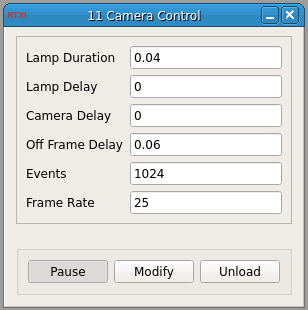

###Camera Control

**Requirements:** None  
**Limitations:** None  

<!--start-->

Adequate description pending. The precise purpose of this module is currently undetermined. It presumably interfaces with a voltage-contolled lamp and sets parameters regarding image acquisition, such as frame rate, delays, etc. 

<!--end-->

####Input Channels
1. input(0) : State - trigger state (=1 to start lamp)

####Output Channels
1. output(0) : Lamp On - 0-5V
2. output(1) : Camera On - 0-5V

####Parameters
1. Lamp Delay (s)
2. Camera Delay (s)
3. Off Frame Delay (s)
4. Events (integer)
5. Frame Rate - (Hz)

####States
None
